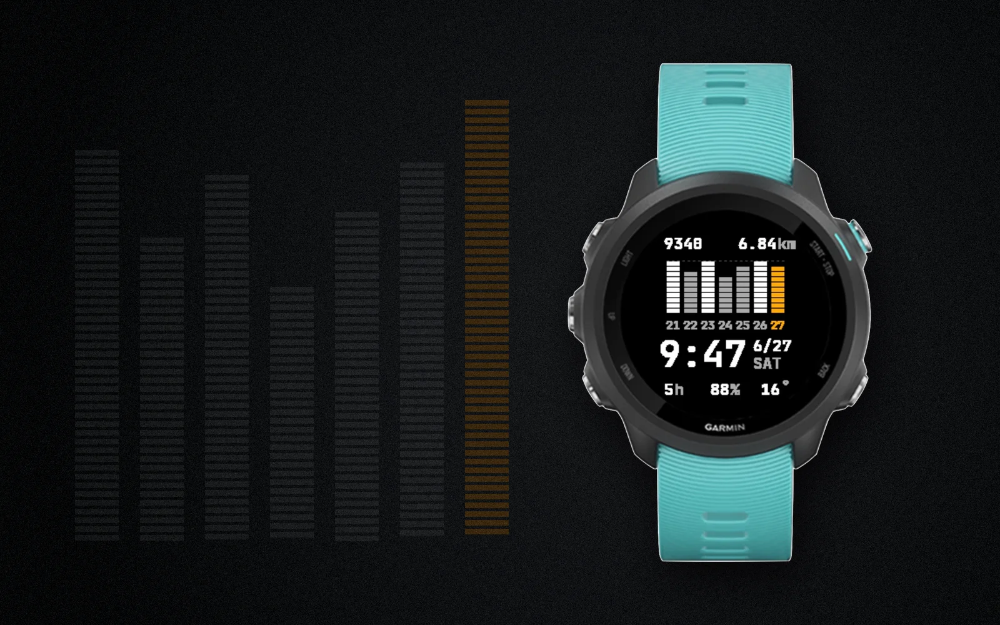

# Stride

A minimalist watch face for the **Garmin Forerunner 245 / 245 Music**. One job: get you to **10,000 steps a day**, and make the time effortless to read.

<p align="center">
  
</p>

Inspired by the Casio G-Shock GBD-200, adapted to the round 240×240 display: a seven-day step chart is the hero, today's bar in amber against the goal line, with the time below and a few motivating readouts framing it. Pure monochrome on black with a single amber accent, all in one clean **JetBrains Mono** typeface.

## What it shows

- **Top:** today's step count (left) and distance in km (right).
- **The chart (the hero):** the last seven days as segmented 10%-blocks. The **goal is the ceiling** — a day that reaches 10k fills to the dashed line at the top. A day that **cleared the goal is white**, one that **fell short is gray**, and **today is amber**. A run of full bars is your streak, at a glance.
- **The time**, large, with the date stacked beside it (`6/27` over `SAT`).
- **Bottom:** recovery hours, Body Battery %, and current temperature — each hides as `--` when its data isn't available.

## Design

- **Pure mono, one accent.** Black surface, white/gray elements, a single amber accent used **only** for today's bar and date number.
- **Built for the panel.** The FR245 is a 64-color memory-in-pixel (MIP) display — reflective, always-on, tuned for sunlight. Every color sits on the panel's `00/55/AA/FF` grid so nothing shifts on-device, and grays are strictly neutral (a blue tint quantizes to purple).
- **One typeface.** JetBrains Mono Bold throughout — time, numbers, words, units — for a single, highly legible voice. Rendered as three bitmap sizes (`tools/genfont.py`).
- **Consistent rhythm.** Even whitespace between the four bands (steps row · chart · time · bottom row).

The design evolved from a literal Casio-LCD homage (DSEG7 segments) through a [Claude Design](https://claude.ai/design) exploration to this clean monospace system — see `docs/DESIGN.md` for the full visual spec.

## Settings (Connect IQ phone app)

| Setting | Options |
|---|---|
| Daily step goal | default 10,000 — the chart scales to it |
| Accent color | Amber · Hot · Ice · White |
| Hour / minute distinction | Colon (`8:32`) · Colored minutes (`832`) |
| Minutes color | Gray · Accent (when colored) |
| Leading zero on hour | 12h: `08:32` vs `8:32` |
| Bar style | Segmented · Solid |
| Show bottom metrics | on / off |

## Build & run

Toolchain (macOS):

```sh
brew install --cask connectiq      # SDK + monkeyc + simulator
brew install openjdk               # JDK monkeyc needs
# developer signing key (once):
openssl genrsa -out ~/.Garmin/developer_key.pem 4096
openssl pkcs8 -topk8 -inform PEM -outform DER -nocrypt \
  -in ~/.Garmin/developer_key.pem -out ~/.Garmin/developer_key.der
```

Download the **Forerunner 245 Music** device via the Connect IQ SDK Manager (it's account-gated). Then build and run:

```sh
monkeyc -f monkey.jungle -d fr245m -y ~/.Garmin/developer_key.der -o bin/Stride.prg -w
connectiq & ; monkeydo bin/Stride.prg fr245m      # run in the simulator
```

Add `-r` for a release build. Set `StepHistory.DEMO = true` to populate the face for screenshots (the simulator can't backfill step history). Full setup, the test matrix, and on-watch sideloading are in `docs/BUILD.md` — note the **245 Music connects over MTP, not as a USB drive** (`tools/mtpsend.c` handles it).

## Project structure

```
stride-watchface/
  manifest.xml          targets fr245m / fr245
  source/
    StrideApp.mc        app entry
    StrideView.mc       the watch face: layout, time, readouts, settings
    WeekChart.mc        the seven-day segmented chart
    Metrics.mc          guarded recovery / Body Battery / weather reads
    StepHistory.mc      rolling self-logged seven-day step model
    Theme.mc            grid-aligned colors + the accent
  resources/
    fonts/              three JetBrains Mono bitmap sizes
    settings/ strings/ drawables/
  tools/                font generator + MTP sideload helper
  docs/                 SPEC · DESIGN · ARCHITECTURE · BUILD · ROADMAP
```

## Notes

- Self-logged step history (not `getHistory()`, which is unreliable on a watch face); on a fresh install only today's bar fills, the rest accrue over the week.
- All sensor/weather reads are `has`-guarded — a missing reading shows `--`. Body Battery works on the FR245M; temperature is null until the phone syncs weather.
- Personal project, dev-signed — not on the Connect IQ store.
